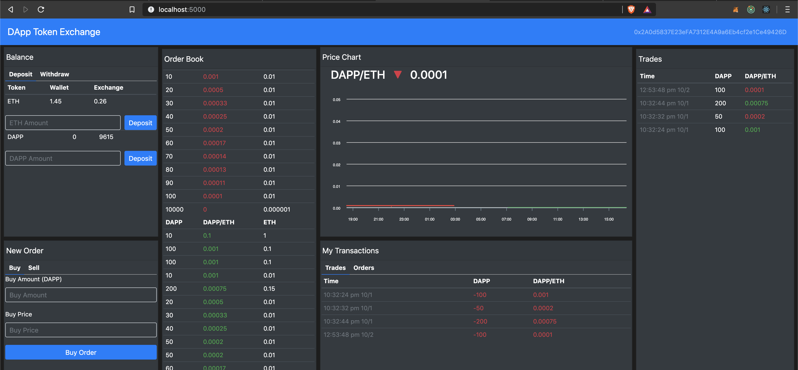
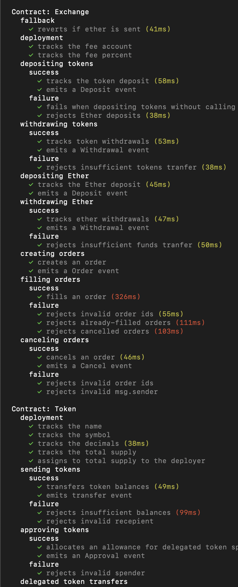

# README

Head to [http://etherswap.herokuapp.com](http://etherswap.herokuapp.com) to see the Dapp in action on the Kovan network:

## Available Scripts

In the project directory, you can run:

### `npm start`

Runs the app in the development mode.  
 Open [http://localhost:3000](http://localhost:3000) to view it in the browser. This will connect to the blockchain, it currently supports Ganache running on port `7545` and the Kovan network where a copy of the smart contract has already been deployed.

### `truffle test`

This command will run all files contained in `/test`, which run some custom unit testing for the Exchange.sol and Token.sol smart contracts, the output looks like the following:

